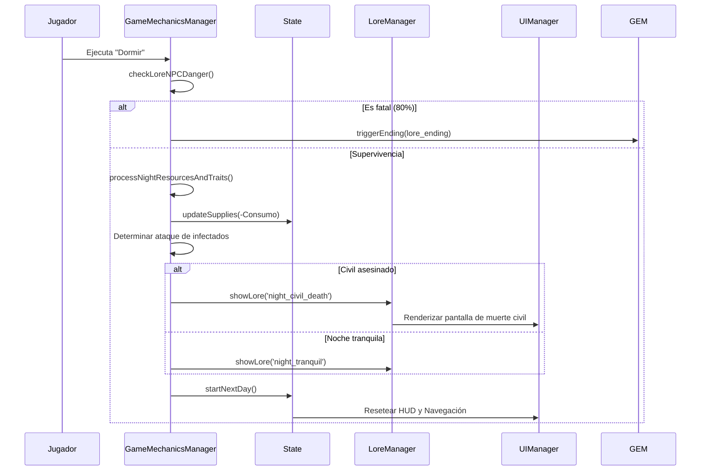
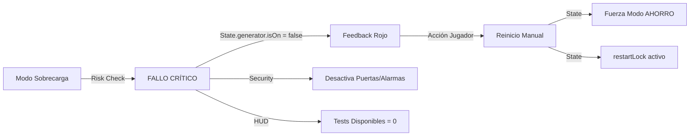

# Flujos de Sistemas Transversales

Este documento detalla cómo interactúan los diferentes gestores para resolver situaciones complejas que afectan a múltiples sistemas.

## 🌙 Resolución de la Fase Nocturna (`sleep`)

Es el momento más crítico del juego. Involucra recursos, rasgos, infecciones y NPCs de Lore.

### Relaciones de Código:
- **`GameMechanicsManager.js`**: Contiene la lógica de decisión.
- **`NPC.js`**: Proporciona los rasgos (`scavenger`, `tough`) que alteran las probabilidades.
- **`LoreData.js`**: Contiene los textos y sonidos de los interludios nocturnos.

---

## ⚠️ Ciclo de Intrusiones

Las intrusiones pueden ocurrir de día o de noche si la seguridad falla.

1. **Trigger**: `RandomEventManager` o el ciclo de `Game.nextTurn` disparan `attemptDayIntrusion()`.
2. **Validación de Seguridad**: `GameMechanicsManager` revisa `State.securityItems` (puertas, ventanas, alarmas).
3. **Selección de Vía**: Si hay un canal no asegurado (`secured: false`), se crea un `NPC` infectado oculto.
4. **Notificación**: 
   - `State.addLogEntry('system', ...)` registra la alerta.
   - `UIManager.setNavItemStatus` activa el indicador de peligro en el HUD (color rojo/alerta).
   - `AudioManager` reproduce `intrusion_detected`.

### Mecánica vs Código:
| Mecánica | Archivo Responsable |
| :--- | :--- |
| Probabilidad de Intrusión | `State.config.securityIntrusionProbability` |
| Modificador por Generador | `State.getIntrusionModifier()` (1.5x si está apagado) |
| Creación del Intruso | `GameMechanicsManager.createIntrusion()` |

---

## ⚡ Fallo y Recuperación del Generador

El generador afecta a la capacidad de testeo y a la seguridad.

### Notas Técnicas:
- El **`restartLock`** impide que el jugador suba la potencia inmediatamente después de un fallo, obligándolo a procesar al menos un NPC en modo AHORRO (mínima información).
- La **Energía de Emergencia** (`emergencyEnergyGranted`) evita que el jugador se quede bloqueado sin poder hacer ningún test si el fallo ocurrió justo al empezar un turno.

---

## 🛡️ Sistema Unificado de Asignación de Sectores

Se ha implementado un sistema centralizado para gestionar la asignación de NPCs a roles críticos (Guardia, Combustible, Suministros).

### Componentes:
1. **`UIManager.showSectorAssignmentModal(sector, state)`**: 
   - Renderiza un modal genérico.
   - Filtra NPCs elegibles (admitidos en ciclos anteriores).
   - Maneja la selección visual y feedback.
2. **`UIManager.renderSectorPanel(container, sector, state)`**: 
   - Renderiza el panel "in-situ" en cada pantalla (`Fuel`, `Supplies`, `Generator`, `Security`).
   - Muestra el guardia actual o el estado vacante.
   - Adapta los colores y bordes según el sector (Verde, Rojo, Ámbar).

### Flujo de Datos:
1. Usuario clickea "ASIGNAR" en el panel del sector.
2. Se abre el modal filtrado.
3. Al seleccionar un NPC:
   - Se actualiza `State.sectorAssignments[sector]`.
   - Se reproduce audio `ui_success`.
   - Se cierra el modal y se refresca el panel.

### Integración en Pantallas:
- **Generador**: Panel de guardia de seguridad principal.
- **Sala de Vigilancia**: Panel secundario de personal de seguridad.
- **Combustible**: "Unidad de Sacrificio" para extracción.
- **Suministros**: "Encargado de Expedición".
