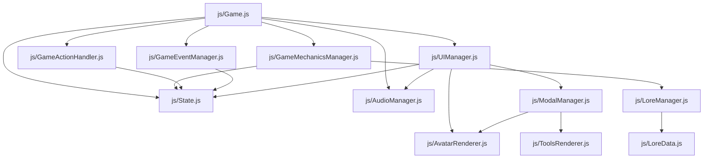

# Arquitectura Técnica - Ruta 01

El proyecto sigue un diseño modular basado en clases de JavaScript (ES6), utilizando un patrón de **Gestores (Managers)** que interactúan a través de un **Estado Global (State)** reactivo.

## 🏗️ Mapa de Dependencias

## 🧩 Componentes Principales

### Núcleo (Core)
- **`js/Game.js`**: La orquesta principal. Inicializa todos los gestores y maneja el bucle principal de juego y la navegación entre pantallas.
- **`js/State.js`**: **El único punto de verdad.** Almacena el estado de la partida, configuración, NPCs admitidos, recursos y progreso. Es un objeto literal que permite acceso global y emite eventos (`CustomEvent`) cuando cambian valores críticos (paranoia, cordura, logs).
- **`js/Constants.js`**: Definiciones constantes para IDs de pantallas, ítems de navegación, tiempos y configuraciones base.

### Lógica de Juego (Gameplay Logic)
- **`js/GameMechanicsManager.js`**: El cerebro de las reglas. Gestiona fallos del generador, consecuencias de purgas, y la compleja **Resolución de la Fase Nocturna**.
- **`js/NPC.js`**: Clase para la generación procedimental. Maneja la lógica de infección, atributos fisiológicos y rasgos.
- **`js/RandomEventManager.js`**: Sistema de eventos aleatorios diarios que pueden afectar al estado del refugio.

### Sistemas Especializados
- **`js/DialogueEngine.js`**: Motor de diálogo que procesa pools de conversación, maneja tags de acción y controla el flujo de interacción. Utiliza un sistema de *flags* en `State` para persistir decisiones.
- **`js/GeneratorManager.js`**: Controla el estado del generador, distribución de energía y modos de operación.
- **`js/LoreManager.js`**: Gestiona el desbloqueo y visualización de fragmentos de historia y finales especiales.
- **`js/AudioManager.js`**: Sistema de sonido con soporte para capas de ambiente y música dinámica.

### Interfaz y Presentación (UI/UX)
- **`js/UIManager.js`**: Encapsula todas las manipulaciones del DOM. Maneja efectos de post-procesado y el Sistema de Escalado de UI.
- **`js/ModalManager.js`**: Gestor de ventanas emergentes (Inspección, Diálogos largos, Confirmaciones).

## 🔄 Flujo de Datos Reactivo

El sistema opera bajo un ciclo de **Acción -> Estado -> Reacción**:

1. **Acción**: El usuario hace clic en un botón (ej: "Purgar" en `ModalManager`).
2. **Lógica**: `GameMechanicsManager` procesa la lógica y actualiza `State.js`.
3. **Estado**: `State.updateParanoia(20)` modifica el valor y dispara un evento `paranoia-updated`.
4. **Reacción**: 
   - `UIManager` escucha el evento y actualiza el HUD.
   - Los efectos de post-procesado (glitches) aumentan automáticamente debido al nuevo valor en `State`.

## 🛠️ Herramientas y Tecnologías
- **Vanilla JS (ES6)**: Módulos nativos.
- **jQuery**: Manipulación de DOM y animaciones.
- **Tailwind CSS**: Diseño visual.
- **Jest**: Testing de lógica (Infección, Suministros, Lore).
